# HDR_Imaging

## LINEARIZE RENDERED IMAGES
This work is to linearize the rendered image which is non-linear. To achieve my goal , I have to solve least squares optimization problem.
The result shows each gradient curve using uniform, tent, gaussian weight scheme for each color channels, respectively. 
As shown below, the gradient curve with gaussian weight scheme is the more smooth than other curves 

<table>
    <tr>
        <th>Weight: Uniform</th>
        <th>Weight: Tent</th>
        <th>Weight: Gaussian</th>
    </tr>
    <tr>
        <td>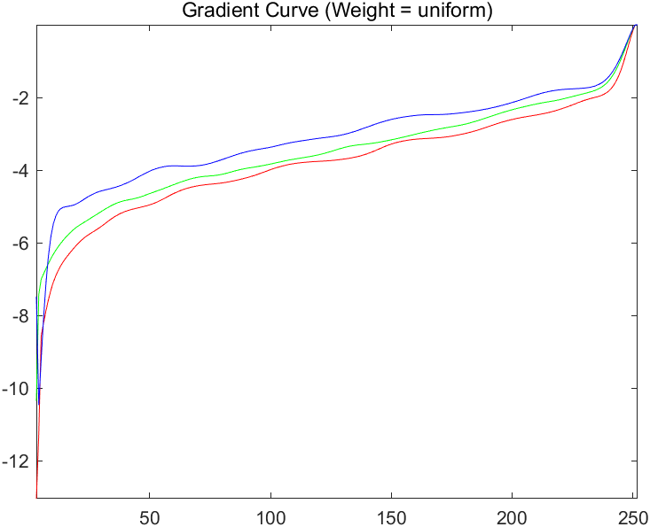</td>
        <td>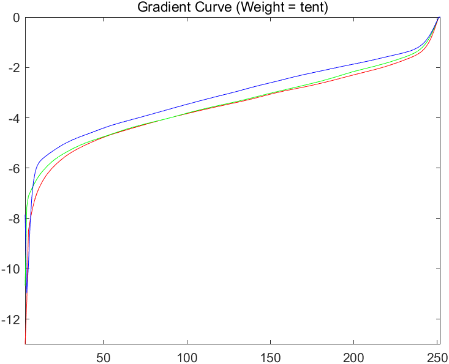</td>
        <td>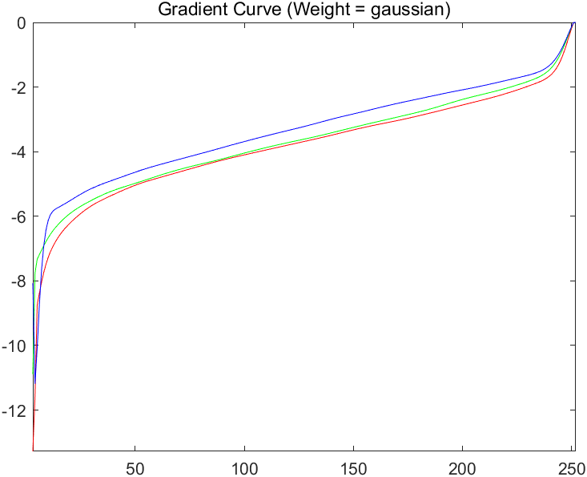</td>
    </tr>
</table>

## MERGE EXPOSURE STACK INTO HDR IMAGE

Several types of exposure images are merged into HDR image.
As shown below, the images with uniform weighting scheme shows best quality when processing with raw image. However, for gaussian and tent weigthing scheme, the quality seems to be at best when images are rendered and logarithmic. 

<table>
    <tr>
        <th>Raw Uniform Linear</th>
        <th>Raw Tent Linear</th>
        <th>Raw Gaussian Linear</th>
    </tr>
    <tr>
        <td>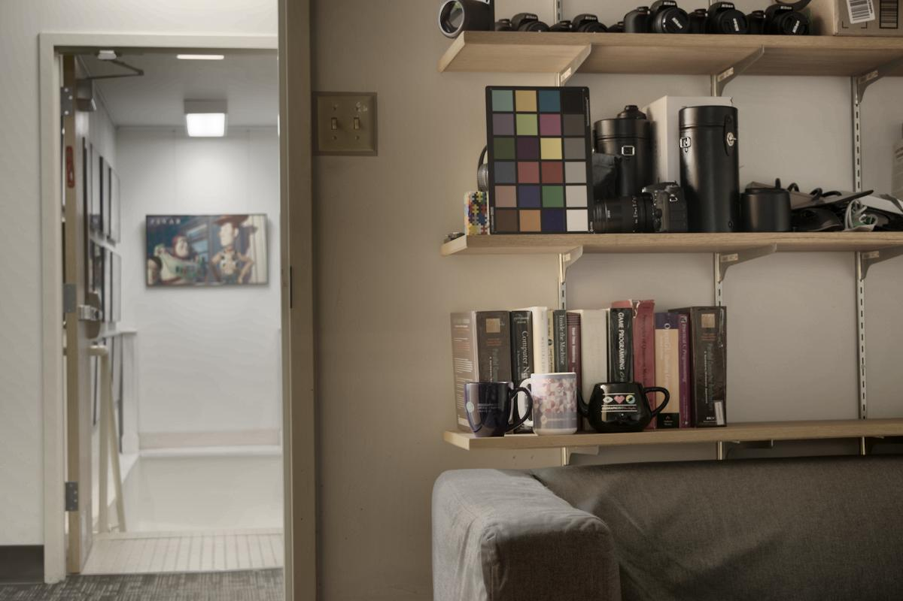</td>
        <td></td>
        <td>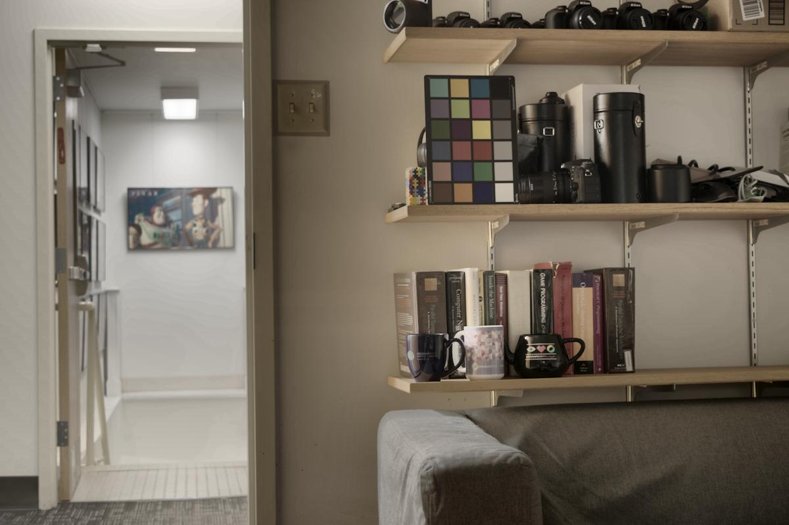</td>
    </tr>
</table>

<table>
    <tr>
        <th>Rendered Uniform Linear</th>
        <th>Rendered Tent Linear</th>
        <th>Rendered Gaussian Linear</th>
    </tr>
    <tr>
        <td></td>
        <td>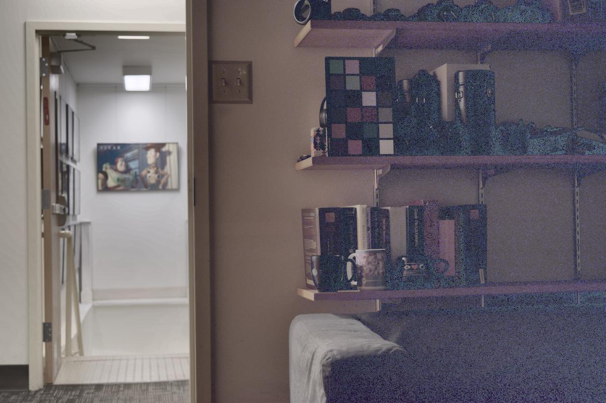</td>
        <td>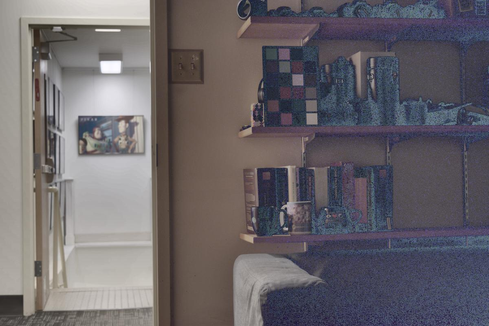</td>
    </tr>
</table>

<table>
    <tr>
        <th>Raw Uniform Logarithmic</th>
        <th>Raw Tent Logarithmic</th>
        <th>Raw Gaussian Logarithmic</th>
    </tr>
    <tr>
        <td>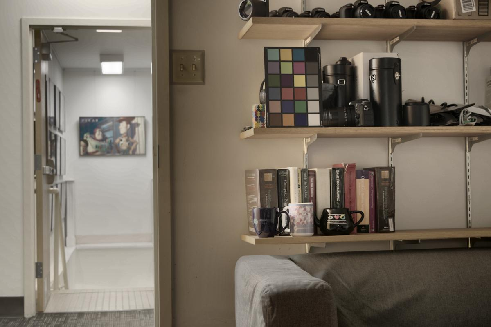</td>
        <td>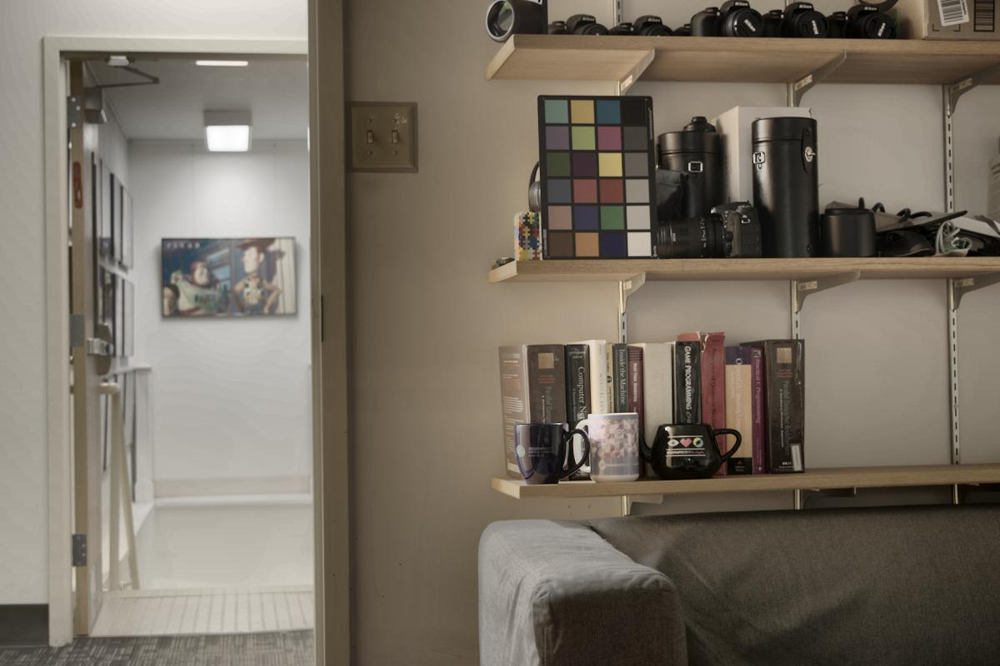</td>
        <td></td>
    </tr>
</table>

<table>
    <tr>
        <th>Rendered Uniform Logarithmic</th>
        <th>Rendered Tent Logarithmic</th>
        <th>Rendered Gaussian Logarithmic</th>
    </tr>
    <tr>
        <td>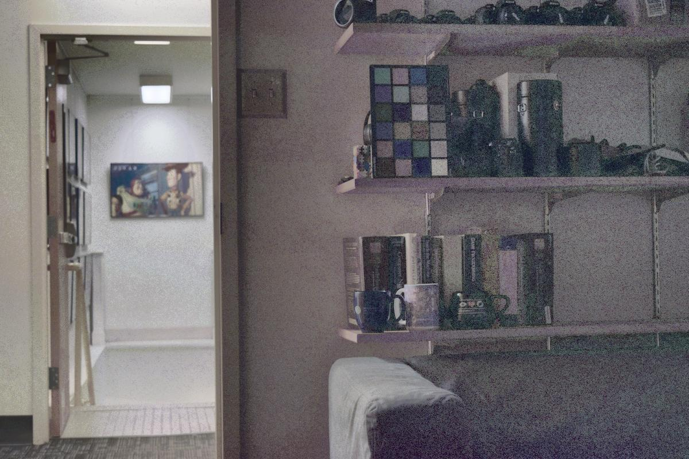</td>
        <td>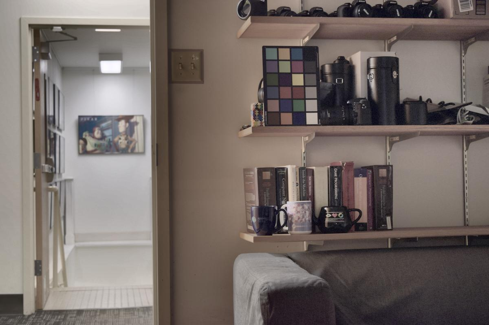</td>
        <td></td>
    </tr>
</table>

## EVALUATION

# TONEMAPPING

## PHOTOGRAPHIC TONEMAPPING

## TONEMAPPING USING BILATERAL FILTERING
